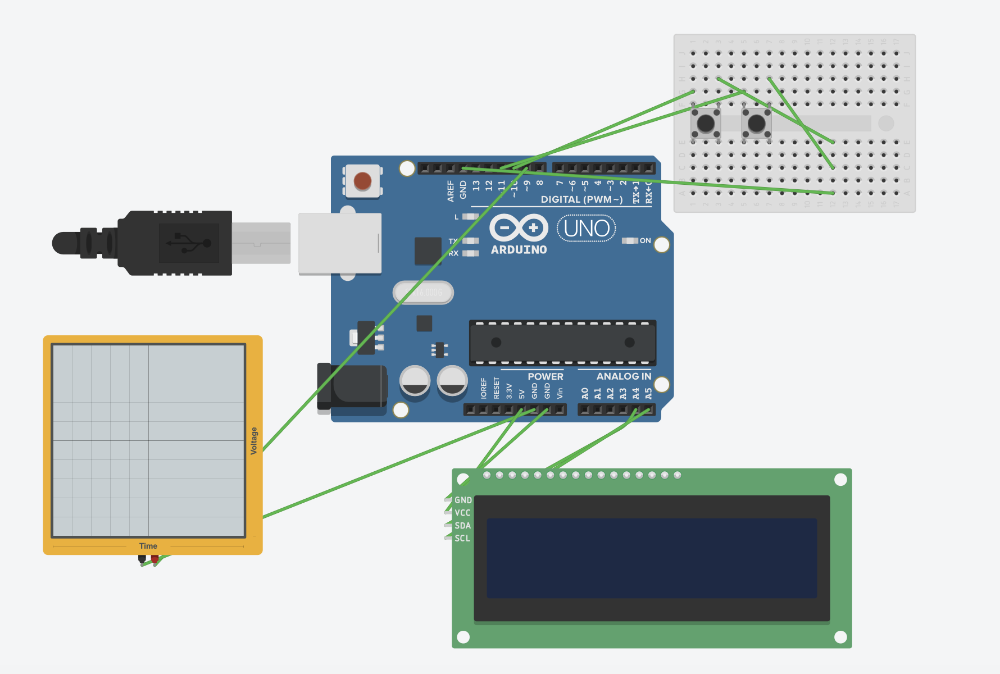

# 8 Bit Generator

## An 8-Bit Generator Using Arduino UNO R3 taking Binary Input from User Via 2 Button one for taking 1 or 0 & another for going to next value,the value taken via button is shown in the LCD Screen and then whole 8-Bit Binary PWM is then displayed in the Oscilloscope .

## Parts Used:-

<ul>
<li>Arduino UNO R3</li>
<li> LCD Screen (I2C)</li>
<li>Push Button(2pc)</li>
<li>Male to Male Wire</li>
<li>Oscilloscope</li>
<li>Breadboard</li>
</ul>

## Working Circuit:-

## Working Video:-
https://youtu.be/RAQZt39dvdU
