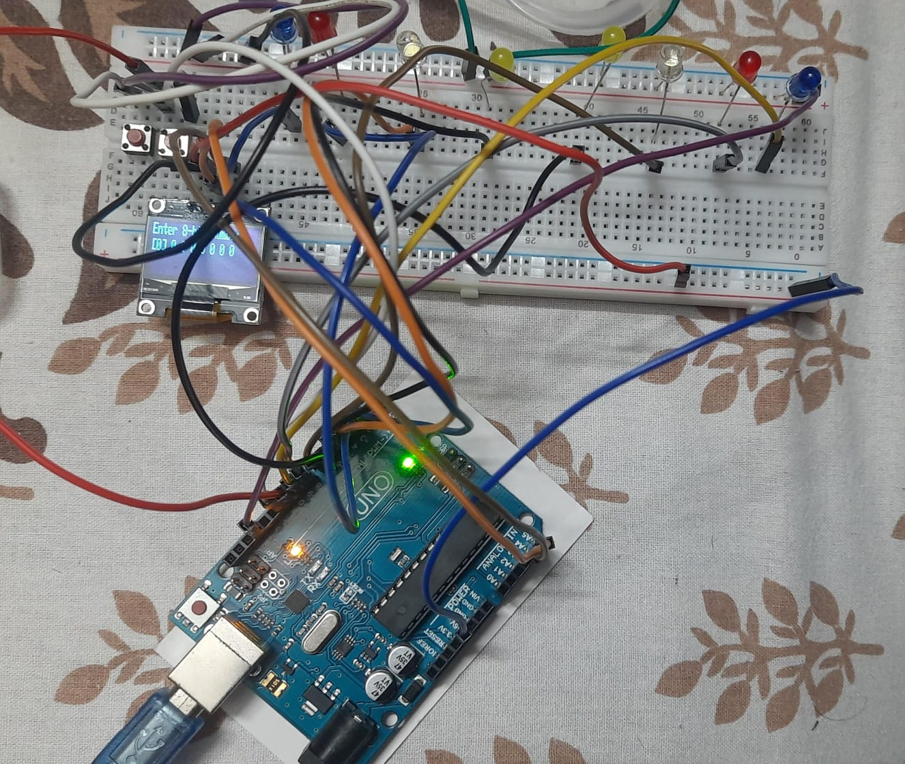

# 8 Bit Generator

## An 8-Bit Generator Using Arduino UNO R3 taking Binary Input from User Via 2 Button one for taking 1 or 0 & another for going to next value,the value taken via button is shown in the OLED Screen and then whole 8-Bit Binary value is then displayed in the set of 8 LED, each representing one bit .

## Parts Used:-

<ul>
<li>Arduino UNO R3</li>
<li> OLED Screen</li>
<li>Push Button(2pc)</li>
<li>Male to Male Wire</li>
<li>LED(8pc)</li>
<li>Breadboard</li>
</ul>

## Working Circuit:-

## Working Video:-
https://youtube.com/shorts/ySdmCxggKvQ
